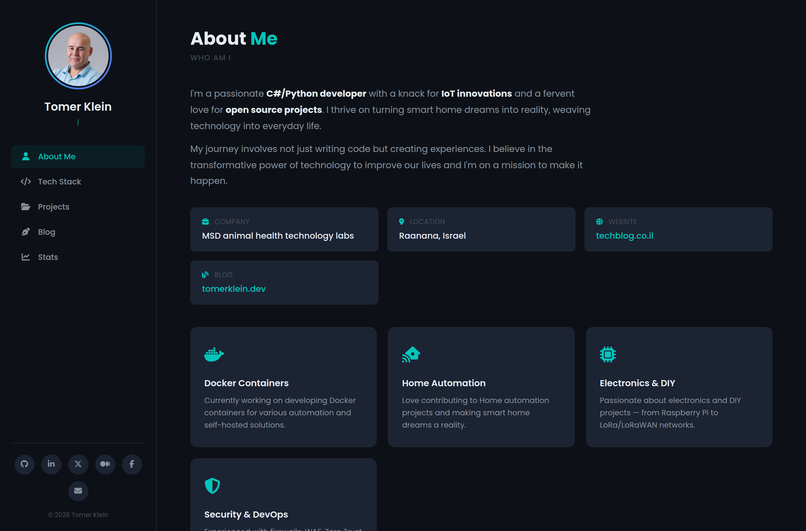
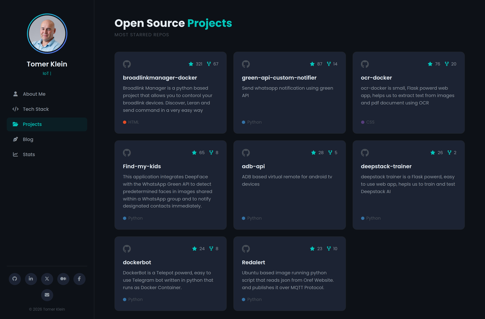
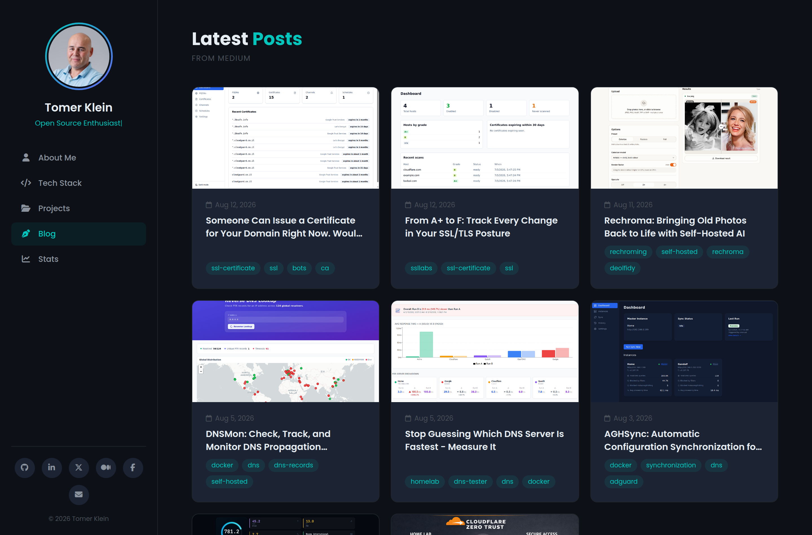
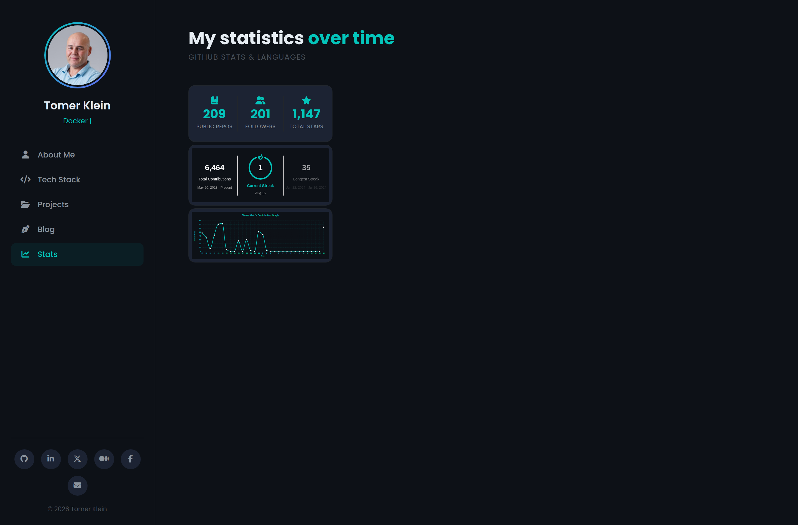

# Tomer Klein — Portfolio

A fast, single-page developer portfolio built as a static site and deployed on
**Cloudflare Pages**. It pulls live data from GitHub and Medium through small
**Pages Functions** (with client-side fallbacks so it also works as a plain
static site), and presents an About page, Projects, Blog posts, and a GitHub
Stats section.

## Features

- **Single-page app** with hash-based section navigation (About, Skills,
  Projects, Blog, Stats) — no framework, just vanilla JS.
- **Live GitHub projects** — top repositories by stars, rendered from the
  GitHub API.
- **Live Medium blog feed** — latest articles via the Medium RSS feed.
- **GitHub stats summary card** — public repos, followers and total stars,
  animated count-up, alongside streak and contribution-graph widgets.
- **Resilient data loading** — every dynamic section calls a cached Pages
  Function first and falls back to the public API directly if the function is
  unavailable, so the site still works when served as static files.
- **Dark, responsive design** with a typing animation and count-up counters.

## Screenshots

### About


### Projects


### Blog


### GitHub Stats


## Tech stack

- **Frontend:** HTML, CSS, vanilla JavaScript (no build step)
- **Serverless API:** Cloudflare Pages Functions (`functions/api/*.js`)
- **Hosting:** Cloudflare Pages
- **Data sources:** GitHub REST API, Medium RSS (via rss2json), and the
  `github-readme-*` widget services

## Project structure

```
.
├── index.html              # The whole page (markup + inline gtag + SW self-heal)
├── css/
│   └── style.css           # Styles, theme variables, responsive rules
├── js/
│   └── main.js             # Navigation, animations, data fetching + fallbacks
├── functions/
│   └── api/
│       ├── blog.js         # GET /api/blog   → latest Medium posts (cached 24h)
│       ├── repos.js        # GET /api/repos  → top starred repos (cached 24h)
│       └── stats.js        # GET /api/stats  → repos/followers/stars (cached 24h)
├── sitemap.xml
└── README.md
```

## Getting started

### Prerequisites

- A static file server (Python, Node, etc.) for a quick local preview, **or**
- [Node.js 18+](https://nodejs.org/) with
  [Wrangler](https://developers.cloudflare.com/workers/wrangler/) to run the
  Pages Functions locally.

### Clone

```bash
git clone https://github.com/t0mer/new_portfolio.git
cd new_portfolio
```

### Option A — quick static preview

Serve the folder with any static server. The `/api/*` endpoints won't exist, so
the page automatically falls back to calling GitHub and Medium directly.

```bash
# Python
python3 -m http.server 8000
# then open http://127.0.0.1:8000/

# …or Node
npx serve .
```

> Opening `index.html` directly via `file://` also works — the code detects the
> `file:` protocol and uses the direct-API fallbacks.

### Option B — full local run with Pages Functions

To exercise the real `/api/blog`, `/api/repos` and `/api/stats` endpoints
(server-side caching, no client-side GitHub rate limits), run it with Wrangler:

```bash
npx wrangler pages dev .
# serves on http://127.0.0.1:8788/ by default
```

## Configuration

There is no config file — the portfolio is personalised by editing a few values
in the source. Replace `t0mer` / `tomer.klein` with your own handles.

### 1. GitHub username

Used to fetch repos and stats. Update it in:

| File | What to change |
| --- | --- |
| `functions/api/repos.js` | `GITHUB_API` URL (`users/<you>/repos`) |
| `functions/api/stats.js` | `GITHUB_USER` and `GITHUB_REPOS` URLs |
| `js/main.js` | `REPOS_FALLBACK` and `USER_FALLBACK` (client fallbacks) |
| `index.html` | the `github-readme-streak-stats` and `github-readme-activity-graph` image `src` URLs (`user=` / `username=`), and the profile/social links |

### 2. Medium blog feed

The blog reads a Medium RSS feed proxied through
[rss2json](https://rss2json.com/):

| File | What to change |
| --- | --- |
| `functions/api/blog.js` | `MEDIUM_RSS_URL` — set your Medium `@handle` and your **own** rss2json `api_key` |
| `js/main.js` | `BLOG_FALLBACK` — same feed URL used as the client fallback |

> **Security:** `blog.js` currently embeds an rss2json API key in source.
> Prefer moving it to a Pages **environment variable / secret** and reading it
> from the function, rather than committing it. Never commit real keys.

### 3. Google Analytics

The `gtag.js` snippet lives in `index.html`. Replace the measurement ID
`G-TDVVS33XNG` (it appears twice) with your own, or remove the snippet to
disable analytics.

### 4. Social & profile links

Edit the sidebar links in `index.html` (GitHub, LinkedIn, Medium, Facebook,
email) to point at your profiles.

### API endpoints

All three functions return JSON and are edge-cached for 24 hours
(`Cache-Control` + Cloudflare `cf.cacheTtl`):

| Endpoint | Returns |
| --- | --- |
| `GET /api/blog` | Latest Medium articles |
| `GET /api/repos` | Top starred public repositories |
| `GET /api/stats` | `{ public_repos, followers, total_stars }` |

## Deployment (Cloudflare Pages)

1. Push this repository to GitHub.
2. In the Cloudflare dashboard: **Workers & Pages → Create → Pages → Connect to
   Git**, and select the repo.
3. Build settings: **no build command**, **output directory = `/`** (root).
   Cloudflare automatically detects the `functions/` directory and deploys the
   `/api/*` routes as Pages Functions.
4. Deploy. Every push to the default branch publishes automatically.

> The page includes a small self-heal script that unregisters any stale service
> worker/caches left on the origin, ensuring visitors always get fresh assets.

## License

No license specified. Add one (e.g. MIT) if you intend others to reuse it.
