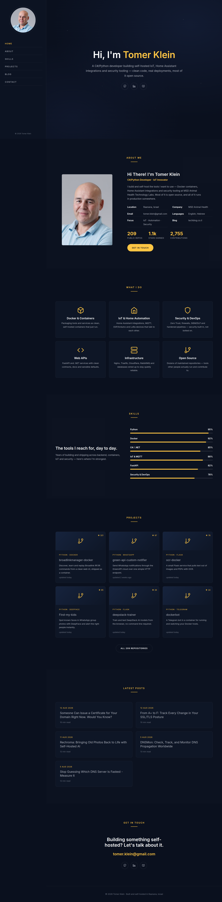
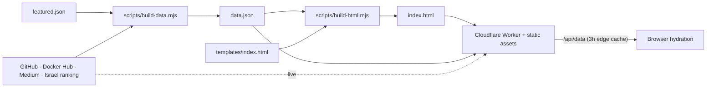

# Tomer Klein — portfolio

A single-page developer portfolio: **dark navy with a gold accent**, a fixed
left sidebar and Inter type, inspired by the "Devis" layout. It renders
**complete, populated HTML on first paint**: repos, posts and counters are
baked in at build time from a committed `data.json`, so there are no
"Loading…" placeholders and no zeroed counters. After the first paint, the
page quietly swaps in fresher numbers from an edge-cached `/api/data` endpoint.

Live at **<https://about.tomerklein.dev/>**, deployed as a **Cloudflare Worker
with static assets**.

## Contents

- [Screenshots](#screenshots)
- [Sections](#sections)
- [How it works](#how-it-works)
- [Data sources](#data-sources)
- [Project structure](#project-structure)
- [Build & run locally](#build--run-locally)
- [Configuration](#configuration)
- [Customizing](#customizing)
- [Automated refresh (GitHub Actions)](#automated-refresh-github-actions)
- [Deployment (Cloudflare Workers)](#deployment-cloudflare-workers)
- [Live API](#live-api)
- [SEO](#seo)
- [Design](#design)
- [Security notes](#security-notes)
- [License](#license)

## Screenshots

### Desktop


### Mobile


## Sections

Fixed sidebar (avatar + nav; a hamburger toggle on small screens) alongside a
scrolling page:

- **Home** — hero with intro and social links (GitHub, LinkedIn, Medium)
- **About** — bio, details and live GitHub figures (public repos · stars earned · contributions)
- **What I do** — service cards
- **Skills** — proficiency bars
- **Activity** — GitHub activity: public-contributions rank in Israel, contributions
  this year, current and longest streak, a weekly contribution strip for the last
  year, plus Docker Hub totals (images · stars · pulls)
- **Projects** — hand-picked repositories (live stars, "updated … ago") and a
  link to all repositories
- **Blog** — latest Medium posts (date and reading time)
- **Contact** — email and social links

## How it works

Everything the browser first receives is static. Two small Node scripts turn
live data into a committed, fully rendered page; a scheduled GitHub Action keeps
it fresh. A tiny Worker serves the files and adds a live stats endpoint that
reuses the same collect/render code, so build-time and live output never drift.


```mermaid
flowchart LR
    F[featured.json] --> BD[scripts/build-data.mjs]
    S[GitHub · Docker Hub · Medium · Israel ranking] --> BD
    BD --> D[data.json]
    D --> BH[scripts/build-html.mjs]
    T[templates/index.html] --> BH
    BH --> I[index.html]
    I --> W[Cloudflare Worker + static assets]
    D --> W
    S -. live .-> W
    W -- "/api/data (3h edge cache)" --> B[Browser hydration]
```

- **`lib/collect.mjs`** — the data collectors (see [Data sources](#data-sources))
  and `mergeData()`, which prefers fresh values and falls back to the previous
  snapshot for anything that failed, so a section is never blanked.
- **`lib/render.mjs`** — pure functions that turn the data into HTML fragments
  (figures, activity tiles and strip, Docker stats, project cards, blog cards).
- **`scripts/build-data.mjs`** — reads `featured.json` and the previous
  `data.json`, runs the collectors, merges, and writes `data.json`. It only
  rewrites the file when something other than the `generatedAt` timestamp changed.
- **`scripts/build-html.mjs`** — fills the `<!--MARKER-->` placeholders in
  `templates/index.html` (`FIGURES`, `REPO_COUNT`, `ISRAEL_RANK`,
  `ACTIVITY_STATS`, `ACTIVITY_CELLS`, `ACTIVITY_CAPTION`, `DOCKER_STATS`,
  `PROJECTS`, `POSTS`, `YEAR`) with `data.json` and writes `index.html`.
- **`worker.js`** — serves static files through the `ASSETS` binding and handles
  `/api/data` and `/api/update` (see [Live API](#live-api)).
- **Client hydration** — a small inline script in the page fetches `/api/data`
  and replaces the dynamic regions. On any failure the build-time values stay.

`data.json` and `index.html` are committed build artifacts. `featured.json` is
hand-edited and never overwritten by the pipeline.

## Data sources

All collectors live in `lib/collect.mjs` and target the account `t0mer`
(Docker Hub namespace `techblog`).

| Data | Source | Notes |
| --- | --- | --- |
| Public repos, followers | `GET https://api.github.com/users/t0mer` | GitHub REST API |
| Total stars | `GET https://api.github.com/users/t0mer/repos?per_page=100` | Summed over up to 6 pages |
| Featured repo stars / last push | `GET https://api.github.com/repos/t0mer/<name>` | One call per entry in `featured.json` |
| Contributions (year), streaks, weekly strip | `https://github.com/t0mer?action=show&controller=profiles&tab=contributions…` | Public contributions calendar, parsed from HTML — **no token needed** |
| Docker Hub images, stars, pulls | `https://hub.docker.com/v2/repositories/techblog/` | Up to 6 pages |
| Rank in Israel | [`gayanvoice/top-github-users`](https://github.com/gayanvoice/top-github-users) `markdown/public_contributions/israel.md` | Position of `t0mer` in the list |
| Latest posts | Medium RSS `https://medium.com/feed/@tomer.klein` | Up to 6 posts; reading time ≈ words / 200 |

## Project structure

```
.
├── index.html                 # generated — the served page (do not hand-edit)
├── templates/index.html       # source template with <!--MARKERS-->
├── data.json                  # generated — build-time data (committed)
├── featured.json              # hand-maintained: featured repos + blurbs
├── css/devis.css              # dark theme: tokens, sidebar, sections, cards
├── assets/
│   ├── fonts/inter.woff2      # self-hosted Inter (variable)
│   ├── portrait.jpg           # self-hosted portrait / avatar
│   ├── og-image.png           # social preview image (Open Graph / Twitter)
│   ├── favicon.ico, favicon-32.png, apple-touch-icon.png
│   └── screenshots/           # README screenshots
├── lib/
│   ├── collect.mjs            # data collectors + mergeData (shared)
│   └── render.mjs             # data → HTML fragments (shared)
├── scripts/
│   ├── build-data.mjs         # collect + merge → data.json
│   └── build-html.mjs         # template + data → index.html
├── worker.js                  # Cloudflare Worker: static assets + /api/*
├── wrangler.jsonc             # Worker config
├── .assetsignore              # files NOT uploaded as static assets
├── robots.txt, sitemap.xml    # SEO
└── .github/workflows/data.yml # scheduled refresh (every 3 hours)
```

## Build & run locally

Requires Node 18+ (for built-in `fetch`). No dependencies, no framework, no
`package.json`.

```bash
# 1. Refresh data (optional — data.json is committed; hits the live APIs)
node scripts/build-data.mjs

# 2. Render the page
node scripts/build-html.mjs

# 3. Serve it
python3 -m http.server 8000
# open http://127.0.0.1:8000/
```

The page is plain static HTML/CSS/JS, so opening `index.html` directly works
too. With a plain static server the `/api/data` call simply fails and the
build-time values stay on screen.

To run the Worker (including `/api/data`) locally, use Wrangler:

```bash
npx wrangler dev   # uses an unpinned Wrangler via npx
```

## Configuration

There are no config files; the only settings are the environment variables
below. Everything else is hard-coded (see [Customizing](#customizing)).

| Name | Where | Required | Description |
| --- | --- | --- | --- |
| `GITHUB_TOKEN` (or `GH_TOKEN`) | env var for `scripts/build-data.mjs` | No | GitHub token. Raises the REST API rate limit; everything works without it. |
| `GITHUB_TOKEN` | Worker secret / variable | No | Same, for the live `/api/data` and `/api/update` routes. |

## Customizing

| Want to change | Edit |
| --- | --- |
| Featured repos and their one-line descriptions | `featured.json` (then re-run both scripts) |
| Colors (accent gold, navy), spacing, sidebar width | the token block at the top of `css/devis.css` |
| Copy, service cards, skill bars, nav | `templates/index.html`, then `node scripts/build-html.mjs` |
| Portrait / avatar | replace `assets/portrait.jpg` |
| GitHub user, Docker Hub namespace, Medium feed, Israel leaderboard URL, max posts | constants at the top of `lib/collect.mjs` |
| GitHub user for featured-repo links | `USER` in `scripts/build-data.mjs` (also set in `lib/collect.mjs`) |
| Social links, email address | hard-coded in `templates/index.html` (hero, About and Contact sections) |

### `featured.json`

An ordered array of repositories to show in **Projects**. Each entry:

```json
{
  "name": "dockerbot",
  "tech": ["Python", "Telegram"],
  "blurb": "A Telegram bot in a container for running and watching your Docker hosts."
}
```

- `name` — repository name under `github.com/t0mer` (required).
- `tech` — tags shown above the title, joined with `·`.
- `blurb` — one-line description.
- `url` — optional; defaults to `https://github.com/t0mer/<name>`.

Stars and last-push dates are filled in automatically. If a lookup fails, the
last known values from `data.json` are kept.

## Automated refresh (GitHub Actions)

`.github/workflows/data.yml` ("Build data"):

- **Triggers:** every 3 hours (`17 */3 * * *`, UTC) and manual dispatch.
- **Steps:** Node 20 → `node scripts/build-data.mjs` (with the workflow's
  built-in `GITHUB_TOKEN`) → `node scripts/build-html.mjs`.
- **Output:** if `data.json` or `index.html` changed, it commits both as
  `github-actions[bot]` with the message `chore: refresh data.json and rebuild page`
  and pushes to the branch it ran on.

## Deployment (Cloudflare Workers)

The site is a **Worker with static assets** (`wrangler.jsonc`):

- `main: worker.js`, Worker name `portfolio`.
- `assets.directory: "."` with binding `ASSETS` — the repo root is the asset
  directory, so `index.html`, `css/`, `assets/`, `data.json`, `robots.txt` and
  `sitemap.xml` are served as-is.
- `.assetsignore` keeps source, tooling and config out of the uploaded assets:
  `node_modules`, `.git`, `.github`, `.wrangler`, `scripts`, `lib`, `templates`,
  `design_handoff_portfolio_refresh`, `worker.js`, `wrangler.jsonc`,
  `package.json`, `package-lock.json`, `featured.json`, `.gitignore`,
  `.assetsignore`, `.dev.vars*` and `*.md`. `worker.js` and `lib/` are bundled
  into the Worker instead. **Anything else in the repo root is uploaded and
  publicly served** — note that `.env*` is git-ignored but *not* in
  `.assetsignore`, so keep `.env` files out of the directory (or add them to
  `.assetsignore`) before a local deploy.
- `nodejs_compat` compatibility flag and observability are enabled.

No build step is needed at deploy time: `index.html` and `data.json` are
committed. Every push to the default branch — including the bot's refresh
commits — deploys through **Cloudflare Workers Builds** (Cloudflare's Git
integration). To deploy manually instead:

```bash
npx wrangler deploy   # uses an unpinned Wrangler via npx
```

Optionally add a `GITHUB_TOKEN` secret to the Worker
(`npx wrangler secret put GITHUB_TOKEN`) to raise the GitHub API rate limit for
the live routes.

## Live API

Served by `worker.js`. Both routes return a JSON object of HTML fragments keyed
by the DOM id each one replaces (`about-figs`, `israel-rank`, `gh-stats`,
`strip-cells`, `strip-caption`, `docker-stats`, `proj-grid`, `blog-grid`). They
also include `repoCount` and `year`, which the page's hydration script does not
use.

| Method | Path | Purpose |
| --- | --- | --- |
| `GET` | `/api/data` | Cached fragments. On a cache miss, recomputes from the live sources (using `data.json` as the fallback snapshot) and caches for 3 hours. Response header `X-Stats-Cache: HIT` or `MISS`. |
| `GET` | `/api/update` | Recomputes now and overwrites the cache. Header `X-Stats-Cache: UPDATED`. |

Cloudflare's cache is per edge location, so `/api/update` refreshes the location
that served the request; other locations refresh on their own 3-hour expiry.
The Worker does not check the HTTP method, so any method works on both routes.
Every other path is served from static assets.

## SEO

- `robots.txt` allows all crawlers and points to the sitemap.
- `sitemap.xml` lists the home page and its main section anchors.
- The template sets a canonical URL, meta description and keywords, Open Graph
  and Twitter card tags (with `assets/og-image.png`), and schema.org `Person`
  structured data (JSON-LD).
- Google Analytics (gtag) is loaded on the page.

## Design

Dark navy (`#0a101e`) with a single gold accent (`#fec544`), self-hosted Inter
with `font-display: swap`, a fixed sidebar, a visible `:focus-visible` ring,
44px touch targets for the menu and social buttons, `prefers-reduced-motion`
support and external links that open in a new tab. No CSS framework, no icon font, no animation library.

## Security notes

- Tokens are optional. Keep any GitHub token in GitHub Actions secrets or
  Cloudflare Worker secrets; never commit it. `.dev.vars*` is git-ignored and
  excluded from the static assets; `.env*` is only git-ignored, so a local
  `wrangler deploy` with a `.env` file present would upload it publicly. Keep
  `.env` files out of the repo directory or add them to `.assetsignore`.
- The GitHub Action uses the built-in `GITHUB_TOKEN` with `contents: write` only
  to commit the refreshed `data.json` and `index.html`.
- `/api/update` is public and unauthenticated, and accepts any HTTP method;
  every call triggers fresh upstream requests.

## License

There is no `LICENSE` file in this repository. The site content — the portrait,
text and other personal material — belongs to Tomer Klein.
